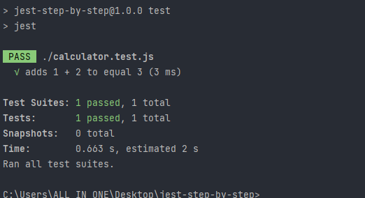

## Jest testing step by step

```bash
npm init -y
```

Then

```bash
npm install --save-dev jest
```

Then add `jest.config.js` file

```javascript
module.exports = {
    testEnvironment: 'node',
};
```

Then create `calculator.js` file and pasting this function to sum two numbers

```javascript
function add(a, b) {
    return a + b;
}

module.exports = {add};

```

- Then create `calculator.test.js` file and require the main calculator functions

```javascript
const {add} = require('./calculator');

test('adds 1 + 2 to equal 3', () => {
    expect(add(1, 2)).toBe(3);
});

```

### Time to test

- Update package.json file

```json
{
  "scripts": {
    "test": "jest",
    "test:watch": "jest --watch"
  }
}
```

- Finally, run `npm run test` and you'll get the next results

